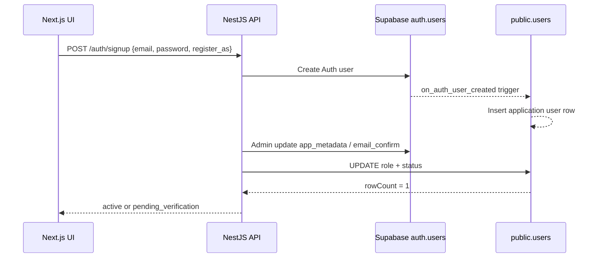

# Auth and Onboarding Journey

Ye document user ke actual experience ke saath UI, API, NestJS, Supabase Auth aur database flow ko explain karta hai.

## 1. Public signup: Candidate ya Employer

User signup page kholta hai. Form me email, password aur **Register as** selector hota hai:

- Candidate (Job Seeker) — default
- Employer / Recruiter

HR aur Admin ka option public signup me nahi hota.

```text
Signup form
  ↓
Next.js → POST /api/v1/auth/signup
  { email, password, register_as }
  ↓
NestJS ValidationPipe
  ↓
Supabase Auth user create
  ↓
trusted role provisioning
  ↓
public.users role/status update
  ↓
signup response
```

NestJS `register_as` ko sirf `candidate` ya `employer` allow karta hai. `hr`, `admin` ya arbitrary value HTTP 400 hoti hai. Client ka `role`, `user_id` ya metadata authorization proof nahi hai.

Supabase Auth user create hone par database trigger `public.users` me application row banata hai. Final application role trusted NestJS `SystemClient` update se set hota hai.

### Database rows aur column-state transition

Signup ke time do related records involved hote hain:



#### Current mode: `AUTH_AUTO_CONFIRM_EMAIL=true`

| Stage | Table | Column | Value before | Value after | Kaun update karta hai |
|---|---|---|---|---|---|
| 1 | `auth.users` | `email` | — | signup email | Supabase Auth |
| 2 | `auth.users` | `raw_app_meta_data.application_role` | — | `candidate`/`employer` | NestJS trusted Admin API |
| 3 | `auth.users` | `email_confirmed_at` | `NULL` | timestamp | Supabase Admin API with `email_confirm=true` |
| 4 | `public.users` | `id` | — | same Auth user UUID | database trigger |
| 5 | `public.users` | `email` | — | normalized signup email | database trigger |
| 6 | `public.users` | `first_name` | — | trigger fallback/name value | database trigger |
| 7 | `public.users` | `role` | `candidate` default | selected candidate/employer | NestJS `SystemClient` |
| 8 | `public.users` | `status` | `pending_verification` default | `active` | NestJS `SystemClient` |

Result: signup ke baad user login kar sakta hai aur server-authoritative role ke basis par dashboard milta hai.

#### Future mode: `AUTH_AUTO_CONFIRM_EMAIL=false`

| Stage | `public.users` column | Initial value | Signup ke baad | Verification ke baad |
|---|---|---|---|---|
| Role | `role` | `candidate` default | selected candidate/employer | unchanged |
| Account state | `status` | `pending_verification` | `pending_verification` | `active` |
| Auth verification | `auth.users.email_confirmed_at` | `NULL` | `NULL` | confirmation timestamp |

Is mode me role turant assign hota hai, lekin `status='active'` hone tak login allowed nahi hota.

#### Failure transition

```mermaid
stateDiagram-v2
    [*] --> AuthCreated
    AuthCreated --> ProvisionedActive: role/status update rowCount=1
    AuthCreated --> CleanupAttempt: Admin/DB provisioning failure
    CleanupAttempt --> [*]: Auth delete succeeds
    CleanupAttempt --> Suspended: delete fails; suspended state persisted
    Suspended --> BlockedLogin: NestJS status check
    BlockedLogin --> [*]: HTTP 401
```



Important check: role/status `UPDATE` ka `rowCount` exactly `1` hona chahiye. Zero-row update ko success nahi maana jayega.

## 2. Current policy: auto-confirm enabled

Current approved setting `AUTH_AUTO_CONFIRM_EMAIL=true` hai, kyunki custom domain/SMTP abhi ready nahi hai.

### Current Supabase Dashboard configuration

Current dashboard me ye settings maintain karni hain:

| Setting | Current value | Reason |
|---|---|---|
| Allow new users to sign up | **ON** | Candidate/employer public signup allowed hai |
| Email provider | **Enabled** | Auth email infrastructure available rahe; future password-reset/email flows ke liye |
| Confirm email | **OFF** | Current auto-confirm policy ke saath signup confirmation email nahi bhejni |
| `AUTH_AUTO_CONFIRM_EMAIL` | **`true`** | NestJS trusted flow account ko active karta hai |

`Confirm email` ko OFF karna aur `AUTH_AUTO_CONFIRM_EMAIL=true` rakhna do alag settings hain. Pehli setting Supabase ke confirmation-email requirement ko control karti hai; doosri NestJS ki onboarding policy ko. Dono current mode me intentionally aligned hain.

Future custom SMTP/domain phase me configuration change hogi:

```text
Confirm email: ON
AUTH_AUTO_CONFIRM_EMAIL=false
```

Tab real email-verification flow activate hoga. Dashboard setting change karne ke baad ek fresh signup se verify karna hoga ki confirmation email aur account status expected behavior de rahe hain.

### Supabase Auth rate-limit deployment checklist

Pre-production testing ke liye **Rate limit for sign-ups and sign-ins = 60 requests / 5 minutes** set kiya gaya hai. Ye database migration ya application code ka part nahi hai; ye Supabase Dashboard configuration hai.

Production deploy karte waqt:

1. Supabase Dashboard → **Authentication → Rate Limits** open karo.
2. Sign-up/sign-in rate limit ki approved production value explicitly set karo.
3. Pre-prod reference value: **60 requests / 5 minutes / source IP**.
4. Email-send limit, sign-up/sign-in limit aur token-refresh limit ko alag samjho.
5. Production load test ke bina limit ko blindly high mat set karo.
6. Final value record karke controlled smoke test run karo.

Current Browser → NestJS → Supabase architecture me IP forwarding disabled hai, isliye Supabase requests NestJS server IP se count kar sakta hai. Supported IP forwarding safely implement hone tak per-user-IP capacity promise nahi karni hai.

Flow:

1. Supabase Auth account create hota hai.
2. NestJS trusted Admin API se `email_confirm=true` set karta hai.
3. NestJS `public.users.role` aur `status='active'` set karta hai.
4. Session obtain hota hai.
5. Access/refresh tokens response body me nahi, HttpOnly cookies me set hote hain.
6. Frontend server ke `/auth/me` response se role lekar dashboard redirect karta hai.

Result:

```text
Create Account
  ├─ Candidate → /dashboard/candidate
  └─ Employer  → /dashboard/employer
```

## 3. Future email-verification policy

Custom domain aur SMTP ready hone par `AUTH_AUTO_CONFIRM_EMAIL=false` kiya jayega.

1. Auth account create hoga.
2. Role NestJS trusted path se assign hoga.
3. Account `pending_verification` rahega.
4. Signup response `{ status: "pending_verification" }` dega.
5. User verification instruction page dekhega.
6. Email confirm hone ke baad account active hoga.
7. Active hone tak login reject hoga.

## 4. Provisioning failure

Auth aur PostgreSQL separate systems hain; inhe ek cross-system transaction nahi maana jata.

```text
Auth user created
  ↓
role/status provisioning
  ├─ success → normal response
  └─ failure → audit event + HTTP 503 ROLE_PROVISIONING_FAILED
```

Failure me error swallow nahi hona chahiye, security audit record hona chahiye, cookies issue nahi hone chahiye, aur Auth user ko login-capable orphan state me chhodne ke liye approved disable/delete ya durable blocked-provisioning recovery hona chahiye.

## 5. Login

Login form me user sirf email/username aur password deta hai; role select nahi karta.

```text
POST /api/v1/auth/login
  ↓
Supabase credential verification
  ↓
NestJS account status/lock/deleted checks
  ↓
user_sessions row
  ↓
HttpOnly cookies
  ↓
GET /api/v1/auth/me
  ↓
server-authoritative role
  ↓
dashboard redirect
```

Redirect mapping:

- candidate → `/dashboard/candidate`
- employer/hr → `/dashboard/employer`
- admin → `/dashboard/admin`

Frontend role guess ya client-supplied role trust nahi karta.

## 6. Cookies aur refresh

- Access: `collabfor_access_token`, HttpOnly, path `/`
- Refresh: `collabfor_refresh_token`, HttpOnly, path `/api/v1/auth/refresh`
- Presence: `collabfor_presence_session`, HttpOnly, path `/api/v1`

Browser cookies request ke saath automatically bhejta hai. Access token expire hone par frontend refresh endpoint call karta hai:

```text
401 response
  ↓
POST /api/v1/auth/refresh
  ↓
refresh cookie
  ↓
NestJS token/account verification
  ↓
new cookies
  ↓
original request retry once
```

Refresh failure par session clear karke login page dikhaya jata hai; infinite retry nahi hota.

## 7. Logout

```text
POST /api/v1/auth/logout
  ↓
verified user + current presence session
  ↓
sirf current user_sessions row offline
  ↓
access/refresh/presence cookies clear
```

Current decision single-session logout hai; doosre devices revoke nahi hote.

## 8. HR onboarding

HR public signup nahi karta.

```text
Employer/Admin
  ↓
HR email par invite
  ↓
HR invite accept
  ↓
NestJS invite verify
  ↓
company membership + HR role
  ↓
employer dashboard
```

Membership aur permissions server-side company boundary ke saath assign hoti hain.

## 9. Security boundaries

- Browser ko service-role key ya database URL nahi milta.
- NestJS JWT signature, expiry, issuer/audience aur account state verify karta hai.
- Business authorization role, ownership, membership aur tenant boundary se hoti hai.
- Supabase RLS approved direct reads ke liye protection layer hai.
- Business writes NestJS trusted path se hote hain.
- Admin/HR accounts invite ya controlled admin flow se provision hote hain.

## References

- `04-nestjs-api/04-nestjs-api-app/src/modules/auth/auth-provider.ts`
- `04-nestjs-api/04-nestjs-api-app/src/infrastructure/config/config.ts`
- `04-nestjs-api/IMPLEMENTATION-TRACKER-HINGLISH.md`
- `02-database/migrations/baseline/03_users_auth.sql`
- `03-nextjs-web/03-nextjs-web-app/src/app/signup/page.tsx`
- `03-nextjs-web/03-nextjs-web-app/src/app/login/page.tsx`
+
