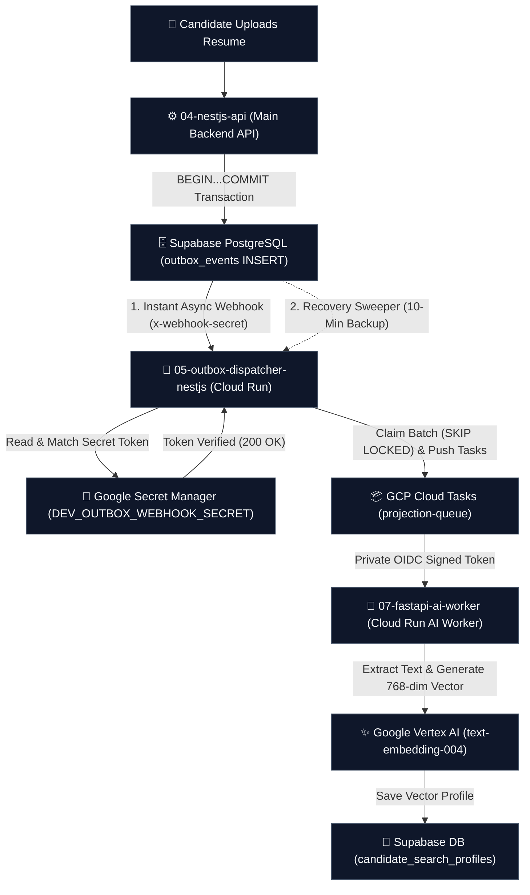

# 📘 Binay Job Portal App — Primary Supabase Webhook & Secret Setup (Operational Master Guide)

> **Document Location:** `02-database/migrations/baseline/19-EASY-GUIDE-DEV-PROD-WEBHOOK-SECRET-SETUP.md`  
> **Document Status:** Operational Implementation & Setup Guide  
> **Target System:** `05-outbox-dispatcher-nestjs` & `02-database` (Supabase PostgreSQL)  
> **Related Architecture ADRs:** `01_extensions_and_schemas.sql`, `15_infrastructure.sql`, `BACKGROUND-WORKER-IMPLEMENTATION-PLAN-HINGLISH.md`  

---

## 🎯 1. Kyu Kar Rahe Hain? (Why Primary Webhook?)

Outbox Pattern me jab koi user resume upload karta hai ya candidate profile update hoti hai, tab business database transaction me `outbox_events` table par ek naya event `INSERT` hota hai.

Dispatcher ko is naye event ki jankari turant milni chahiye taaki wo Cloud Tasks ko payload bhej sake. Iske liye hum **Supabase Native Asynchronous Database Webhook** ko Primary Wake-Up Mechanism use kar rahe hain:

### Key Reasons & Advantages:
1. **Near-Real-Time Wake-up:** Jaise hi `outbox_events` me new row `INSERT` hoti hai, Supabase platform turant Dispatcher ke `/internal/dispatcher/wake` endpoint ko low-latency wake-up signal bhejta hai.
2. **Minimal Database Overhead (Async Out-of-Band):** Webhook call database business transaction ke bahar asynchronously chalti hai. Database `BEGIN...COMMIT` block wait nahi karta aur business write 100% unblocked rehta hai.
3. **Pure Schema DDL (No SQL Side-Effects):** SQL database migration files (`01` se `18`) 100% pure DDL rehti hain. Codebase me koi hardcoded URLs ya triggers commit nahi hote.
4. **Layered Defense (Fail-Safe Architecture):**
   - **Primary Trigger:** Supabase Native Webhook (Low-latency wake-up signal)
   - **Backup Safety Net:** GCP Cloud Scheduler Recovery Sweeper (`dev-outbox-recovery-sweep` every 10 min)
   - **Result:** Outbox events safely DB me `pending` status me rehte hain; agar Webhook call transient fail ho, to Recovery Sweeper 10 min baad automatic process kara deta hai.

---

## 🔐 2. Google Secret Manager Kya Hai? (Aasan Misaal)

Google Secret Manager Google Cloud ki ek **High-Security Digital Tijori (Digital Locker/Vault)** hai. Iska kaam app ke sensitive passwords, API keys, aur security tokens ko bilkul safe rakhna hai.

### Hamare Binay Job Portal App me iske Examples:
1. `WEBHOOK_SECRET` (Supabase Webhook aur Dispatcher ke beech ka VIP Security Password)
2. `SUPABASE_SERVICE_ROLE_KEY` (Database access key)
3. `DATABASE_URL` (Supabase PostgreSQL Connection String)
4. `VERTEX_AI_API_KEY` / GCP Service Account Key

---

## ❌ 3. Galat Tarika vs ✅ Sahi Production Setup

### ❌ Galat Tarika (Hardcoding Raw Secrets in Code / Git / Markdown):
```python
raw_secret = "7e36febbc2e4aa47655503d6a0d16add"
```
*Nuksan:* Agar real secret GitHub, screenshots ya docs me expose hua, to secret **compromised** mana jayega aur immediately rotate karna padega.

### ✅ Sahi Production Setup (Google Secret Manager & Cloud Run Binding):
- Google Secret Manager (Digital Vault) ➔ `DEV_OUTBOX_WEBHOOK_SECRET` (64-Char Token in Vault)
- **Cloud Run Secret Binding:** Cloud Run container startup par Secret Manager se key ko `WEBHOOK_SECRET` environment variable me bind karta hai.
- NestJS App (`05-outbox-dispatcher`) `process.env.WEBHOOK_SECRET` se read karke in-process compare karta hai.

Isse secret kabhi code ya GitHub me nahi jata, security access Google IAM se restrict rehta hai, aur password jab chahe Secret Manager se bina code badle rotate ho sakta hai.

---

## 🔄 4. Hamare App Ka Real Event Flow (Resume Upload Visual Flowchart)

Aaiye dekhein jab koi Candidate resume upload karta hai to hamare App me Secrets aur Microservices kaise kaam karte hain:



---

## 🛠️ 5. Secret Manager vs Cloud Tasks (Farak Samajhna)

- Google Secret Manager: App ki Digital Tijori hai (Passwords, API keys, tokens safe rakhta hai).
- Google Cloud Tasks: App ki Queue Line Manager hai (Jobs aur AI processing ko line me lagati hai aur process karwati hai).

---

## 🚀 6. Dev vs Prod Environment Setup (100% Parity)

| Feature | Dev Environment (Live Active) | Production Environment |
|---|---|---|
| Secret Storage | GCP Secret Manager (DEV_OUTBOX_WEBHOOK_SECRET) | GCP Secret Manager (PROD_OUTBOX_WEBHOOK_SECRET) |
| Token Length | 64-Character Secure Token | 64-Character Secure Token |
| Cloud Run Binding | Dynamic Secret Manager Binding | Dynamic Secret Manager Binding |

---

## ⚡ 7. RAM Caching & Secret Change Behavior (Load Hone Wali Baatein)

### 🚀 Performance Caching:
- Cloud Run Dispatcher container jab boot hota hai, to wo Google Secret Manager se Secret Key ko **apne process RAM me 1 baar load kar leta hai**.
- Supabase se aane wali har incoming request ko Guard CPU RAM me **In-Process Local Token Comparison** se verify karta hai (per-request Secret Manager network call nahi hoti).

### 🔄 Dual-Secret Zero-Downtime Rotation SOP:
1. **Dispatcher Dual-Secret Deploy:** Dispatcher ko temporary period ke liye **Old + New Secret** dono accept karne ke liye update & deploy karein.
2. **Secret Manager & Supabase Webhook Update:** Google Secret Manager (`PROD_OUTBOX_WEBHOOK_SECRET`) aur Supabase Dashboard Webhook header (`x-webhook-secret`) me Naya Secret set karein.
3. **Verification & Cleanup:** Supabase Webhook logs me `200 OK` status confirm hone ke baad Dispatcher se Old Secret remove karke final clean version deploy karein.

---

## 🚨 8. Dev Supabase Dashboard Setup Checklist (MANDATORY ACTION REQUIRED)

> [!IMPORTANT]
> **MANDATORY DEV ACTION REQUIRED (ISKO EXECUTE KARNA HI KARNA HAI):**  
> Developers ko ye Dashboard setup steps **MANDATORY EXECUTE** karne hain taaki `outbox_events` table me row `INSERT` hote hi Dispatcher ko instant wake-up signal mil sake!

### 📝 Mandatory Step-by-Step UI Checklist:

1. **Supabase Dashboard Open Karein:** Dev Project (`jzpvssryooucygnuifkb`) select karein.
2. **Navigation:** Left Menu ➔ **Database** ➔ **Webhooks** ➔ Click **Create a new webhook**.
3. **Form Fields:**
   - **Name:** `outbox_events_insert_wake`
   - **Table:** `outbox_events` (Schema: `public`)
   - **Events:** Sirf **`INSERT`** check mark karein (Uncheck UPDATE & DELETE).
   - **Method:** `POST`
   - **URL:** `https://dev-outbox-dispatcher-163481994238.asia-south1.run.app/internal/dispatcher/wake`
   - **Timeout:** `5000` ms (5 Seconds)
   - **HTTP Headers (2 Custom Headers):**
     - Header 1: `x-webhook-secret` ➔ `<DEV_OUTBOX_WEBHOOK_SECRET_FROM_SECRET_MANAGER>`
     - Header 2: `Content-Type` ➔ `application/json`
4. **Save Click Karein.**

---

## 🏭 9. Production Setup & Secret Rotation Procedure (OP-3 Compliance)

1. **Fetch Production Webhook Secret:**
   `gcloud secrets versions access latest --secret=PROD_OUTBOX_WEBHOOK_SECRET`
2. **Navigate to Production Supabase Dashboard:** Database ➔ Webhooks ➔ Create Webhook (`prod_outbox_events_insert_wake`).
3. **Dual-Secret Zero-Downtime Rotation SOP:**
   - Dispatcher me Old + New secret support deploy karein.
   - Secret Manager (`PROD_OUTBOX_WEBHOOK_SECRET`) aur Supabase Webhook Header update karein.
   - Webhook `200 OK` verify hone ke baad Dispatcher se Old Secret remove karein.

---

## 🗄️ 10. Supabase Database Webhook Prerequisite SQL (Fallback Guide)

Supabase Dashboard Webhooks UI internally `pg_net` extension use karti hai. Normally Dashboard me Webhook create karte hi Supabase platform trigger setup auto-handle karta hai.

Agar UI creation ke waqt extension missing ka error aaye, to DBA-reviewed non-destructive fallback script [`02-database/migrations/baseline/19_supabase_webhook_prerequisites.sql`](file:///c:/Users/ADMIN/OneDrive/Desktop/Vishesh/Binay-Job-Portal-App/02-database/migrations/baseline/19_supabase_webhook_prerequisites.sql) ko SQL Editor me run karein. Isme `CREATE EXTENSION IF NOT EXISTS pg_net;` clean default schema binding ke saath configured hai.
