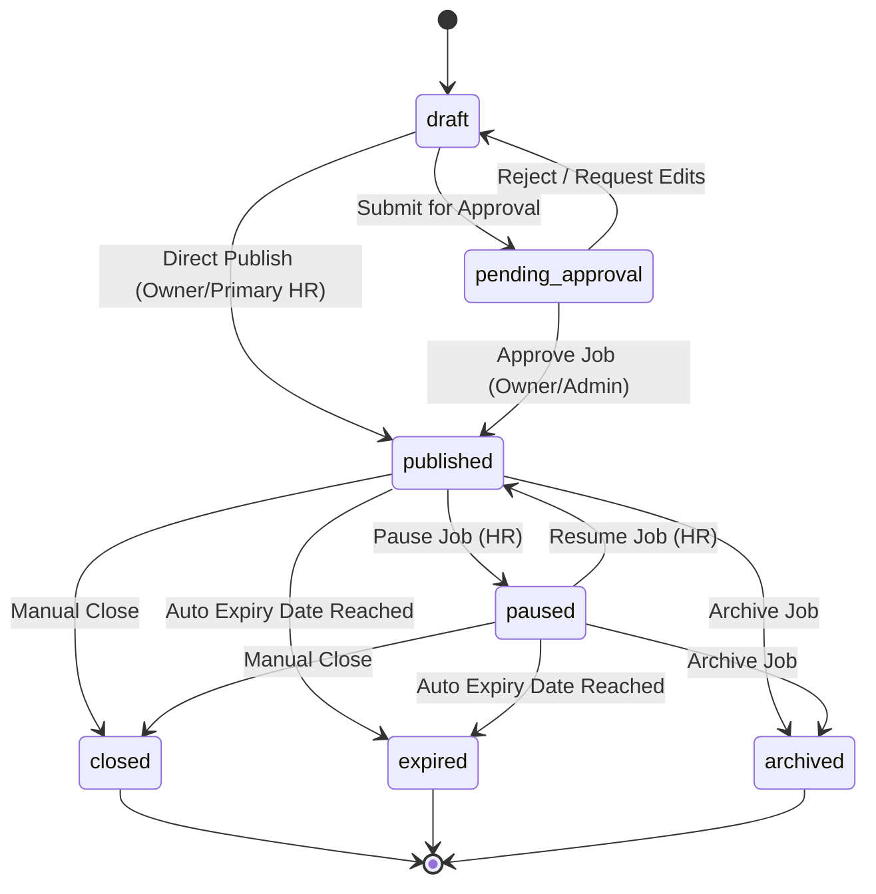
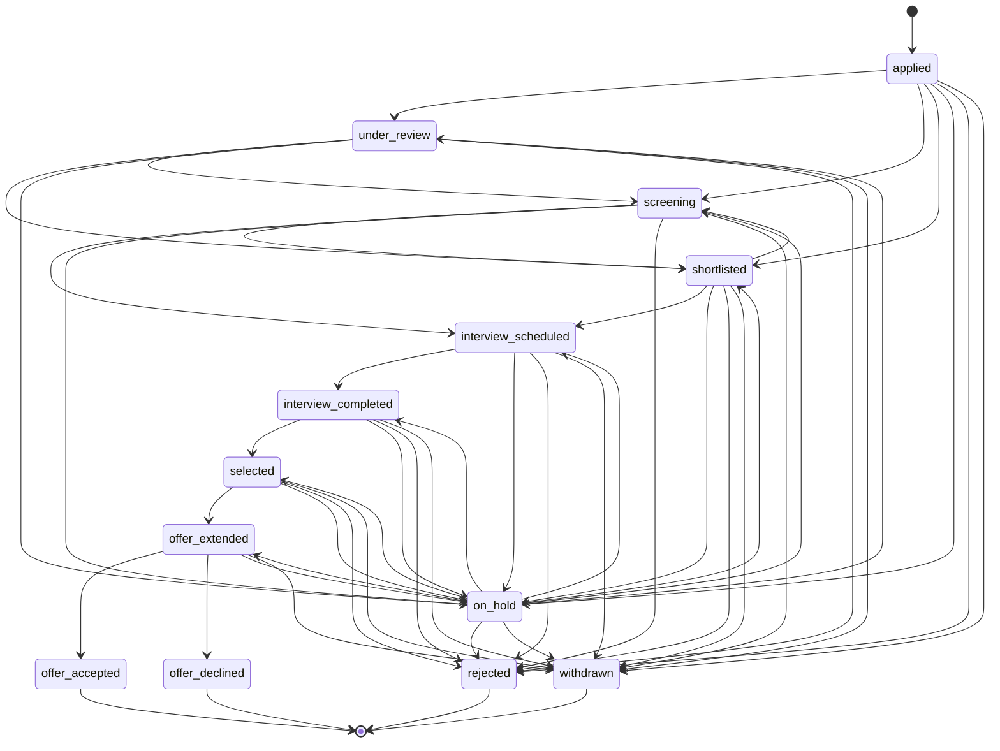

# 🏛️ Job and Application Transition Policy Audit Report

**Target Component:** `04-nestjs-api` State Machines & Workflow Transitions  
**Auditor:** Antigravity (Senior NestJS, PostgreSQL & Product Workflow Architect)  
**Date:** 2026-08-23  
**Target File Location:** `04-nestjs-api/04-nestjs-api-app/antigravity-JOB-APPLICATION-TRANSITION-AUDIT.md`  
**Overall Verdict:** **PASS WITH FIXES & API CATALOG REQUIREMENTS**  

---

## 1. Executive Summary

An objective, evidence-based audit was performed on the job posting and job application lifecycle transitions for Binay Job Portal. The audit evaluated database baseline enums (`02_enums.sql`), schema DDLs (`05_jobs.sql`, `09_applications.sql`), baseline triggers/stored procedures (`change_application_status`), product decisions (`PD-003-APPLICATION-HISTORY.md`), and state machine documents (`PHASE-04-STATE-MACHINES-AND-TRANSACTIONS.md`).

### Key Findings:
- **Application Transitions:** 100% enforced in database DDL via `change_application_status()` procedure (`09_applications.sql` lines 573–652) and blocked from ad-hoc DML updates via `enforce_application_status_update_path()` trigger (lines 654–664).
- **Job Transitions:** PostgreSQL enum `job_status` exists (`02_enums.sql` lines 161–169), but `05_jobs.sql` currently lacks a database-level `change_job_status()` function and `job_status_history` table. NestJS API Gateway MUST enforce the job state transition matrix in domain service code.
- **Terminal Reopen Policy:** Terminal jobs (`closed`, `expired`, `archived`) and terminal applications (`offer_accepted`, `offer_declined`, `rejected`, `withdrawn`) CANNOT be reopened. Reposting requires a NEW `job_id` per `PD-003`.

---

## 2. Verified Current Behavior (SQL & Code Evidence)

### A. Database Enums (`02_enums.sql`):
1. **`job_status` Enum (lines 161–169):**  
   `draft`, `pending_approval`, `published`, `paused`, `closed`, `expired`, `archived`.
2. **`application_status` Enum (lines 262–276):**  
   `applied`, `under_review`, `shortlisted`, `screening`, `interview_scheduled`, `interview_completed`, `selected`, `offer_extended`, `offer_accepted`, `offer_declined`, `rejected`, `withdrawn`, `on_hold`.

### B. Executable SQL Transition Guard (`09_applications.sql`):
`change_application_status()` procedure enforces the exact allowed transitions:
- `applied` ➔ `under_review`, `screening`, `shortlisted`, `rejected`, `withdrawn`, `on_hold`
- `under_review` ➔ `screening`, `shortlisted`, `rejected`, `withdrawn`, `on_hold`
- `screening` ➔ `shortlisted`, `interview_scheduled`, `rejected`, `withdrawn`, `on_hold`
- `shortlisted` ➔ `screening`, `interview_scheduled`, `rejected`, `withdrawn`, `on_hold`
- `interview_scheduled` ➔ `interview_completed`, `rejected`, `withdrawn`, `on_hold`
- `interview_completed` ➔ `selected`, `rejected`, `withdrawn`, `on_hold`
- `selected` ➔ `offer_extended`, `rejected`, `withdrawn`, `on_hold`
- `offer_extended` ➔ `offer_accepted`, `offer_declined`, `withdrawn`, `on_hold`
- `on_hold` ➔ `under_review`, `screening`, `shortlisted`, `interview_scheduled`, `interview_completed`, `selected`, `offer_extended`, `rejected`, `withdrawn`
- **Terminal States (No outbound transitions):** `offer_accepted`, `offer_declined`, `rejected`, `withdrawn`.

---

## 3. Proposed Transition Matrix

### A. Job State Transition Matrix



### B. Application State Transition Matrix



---

## 4. Actor and Permission Matrix

| Transition | Primary Actor | Guard Permission Required |
|---|---|---|
| **Create Job Draft** (`* -> draft`) | Company HR / Recruiter | `job.create` + `is_company_member(company_id)` |
| **Submit Job Approval** (`draft -> pending_approval`) | Recruiter | `job.submit_approval` |
| **Publish Job** (`draft/pending_approval -> published`) | Company Owner / Primary HR / Admin | `job.publish` + Owner/Admin Role |
| **Pause / Resume Job** (`published <-> paused`) | Company HR | `job.update_status` |
| **Close / Archive Job** (`published/paused -> closed/archived`) | Company HR / Owner | `job.close` |
| **Job Expiry** (`published/paused -> expired`) | System (Cron / Scheduled Sweep) | System Worker Service Role |
| **Submit Application** (`* -> applied`) | Registered Candidate / Guest Session | Authenticated Candidate / Active Guest Session |
| **Withdraw Application** (`* -> withdrawn`) | Application Owner (Candidate) | Candidate JWT (`user_id = application.user_id`) |
| **Review / Screen / Shortlist** (`applied -> under_review/screening/shortlisted`) | Assigned Recruiter / HR | `application.review` + `is_company_member` |
| **Schedule / Complete Interview** (`shortlisted -> interview_scheduled -> completed`) | Recruiter / Interviewer | Interview Module + `is_company_member` |
| **Select / Extend Offer** (`interview_completed -> selected -> offer_extended`) | Primary HR / Company Owner | `application.offer_management` |
| **Accept / Decline Offer** (`offer_extended -> offer_accepted/declined`) | Candidate | Candidate JWT (`user_id = application.user_id`) |
| **Reject Candidate** (`* -> rejected`) | Assigned HR / Recruiter | `application.reject` (Reason Mandatory) |

---

## 5. Terminal States and Reopen Rules

1. **Terminal Job States:** `closed`, `expired`, `archived`.  
   - **Reopen Policy:** Reopening a terminal job is **PROHIBITED**. Vacancy reposting MUST create a new `job_id`.
2. **Terminal Application States:** `offer_accepted`, `offer_declined`, `rejected`, `withdrawn`.  
   - **Reopen Policy:** Terminal applications CANNOT transition out. Candidate reapplying to the same job is blocked by DB uniqueness `uq_registered_application_per_job` (`UNIQUE(job_id, candidate_id)`). To reapply, candidate must apply to a NEW `job_id`.

---

## 6. SQL Mismatches & Gaps Identified

1. **Job Status Update Guard Gap:**  
   Unlike `job_applications`, `05_jobs.sql` allows ad-hoc `UPDATE jobs SET status = ...`.  
   *Recommendation:* NestJS Domain Service MUST wrap all job status updates in an atomic transaction and enforce valid state transition checks.
2. **Job History Tracking:**  
   `09_applications.sql` has `application_status_history`. `05_jobs.sql` currently lacks a `job_status_history` table.  
   *Recommendation:* NestJS should emit `job.status.changed` outbox events and record audit log entries in `audit_logs` for job status updates.

---

## 7. Product Decisions Required (`NEEDS_CLARIFICATION`)

1. **Direct Publish Permission (`GAP-JOB-01`):** Should Company Owners and Primary HRs be allowed to bypass `pending_approval` and publish directly from `draft`? *(Recommended: YES for Owners/Primary HR, NO for Junior HR).*
2. **Candidate Withdrawal Cutoff (`GAP-APP-01`):** Can a candidate withdraw after an offer is extended (`offer_extended`)? *(Current SQL allows `offer_extended -> withdrawn`; recommended to retain).*
3. **Mandatory Rejection Reason:** `09_applications.sql` line 627 records `p_change_reason`. Should rejection reason be mandatory for `rejected` status? *(Recommended: Mandatory in NestJS DTO).*

---

## 8. API Catalog Requirements (Phase 6 Input)

The following endpoints will be defined in the Phase 6 API Catalog:

```http
POST   /api/v1/jobs/:id/submit-approval
POST   /api/v1/jobs/:id/publish
POST   /api/v1/jobs/:id/pause
POST   /api/v1/jobs/:id/resume
POST   /api/v1/jobs/:id/close

POST   /api/v1/applications/:id/status          (HR status transition)
POST   /api/v1/applications/:id/withdraw        (Candidate withdrawal)
POST   /api/v1/applications/:id/respond-offer   (Candidate offer accept/decline)
```

### HTTP Response Standards:
- Valid Transition: `200 OK` (returns updated entity + new status history ID).
- Invalid Transition: `400 Bad Request` (`"Invalid status transition from X to Y"`).
- Permission Denied: `403 Forbidden` (`"Insufficient permission for status transition"`).
- Duplicate / Idempotent Request: `200 OK` (same status repeat returns current state without creating duplicate history rows).

---

## 9. Implementation Readiness

- **Status:** **PASS WITH FIXES & API CATALOG REQUIREMENTS**
- Unblocks Phase 5 Final Requirements Freeze and Phase 6 API Catalog mapping.
