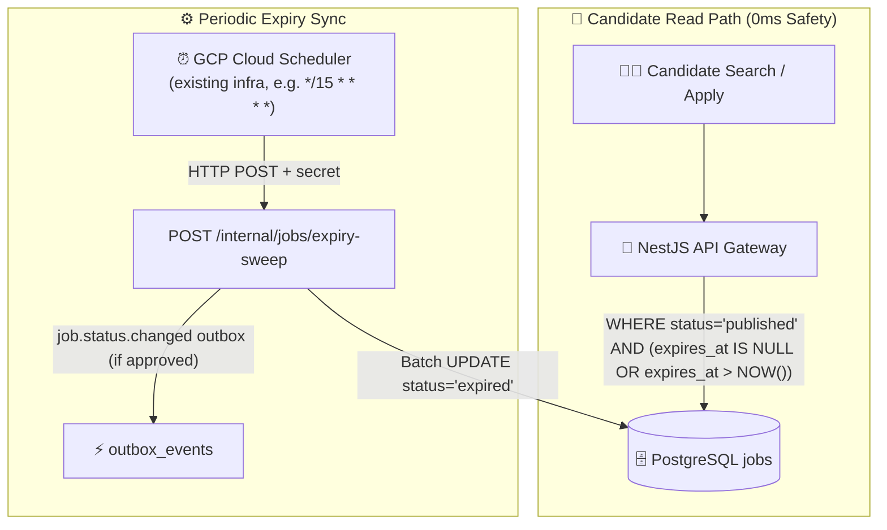

# Kilo — Automatic Job Expiry Audit

**Target Component:** `04-nestjs-api`, `02-database`, `05-outbox-dispatcher-nestjs`  
**Architect:** Kilo  
**Date:** 2026-08-24  
**Status:** `NEEDS_DECISION` — Expiry is a real business requirement; implementation path requires product and architectural decisions

---

## 1. Root Cause

The automatic job expiry concern originates from a **structural gap between schema intent and execution mechanism**:

1. **Schema intent exists:** `02_enums.sql:161-169` defines `expired` as a formal `job_status` enum value. `05_jobs.sql:165` defines `expires_at TIMESTAMPTZ` with comment `-- Auto-close after this date`. `05_jobs.sql:647-648` builds a partial index `idx_jobs_expiring` specifically for "upcoming expiry for notifications."

2. **Execution mechanism does not exist:** There is **no** `change_job_status()` function, **no** `job_status_history` table, **no** BEFORE UPDATE trigger on `jobs.status`, **no** database scheduler, and **no** worker/cron job anywhere in the repository that physically transitions a job from `published`/`paused` to `expired` when `expires_at <= NOW()`.

3. **The tension:** Without a physical transition, `jobs.status` remains `published` indefinitely. Candidate search queries that filter only on `status = 'published'` would continue to return expired jobs. The `idx_jobs_expiring` index and the analytics `jobs_expired` counter (`13_analytics.sql:122`) were built for an event that never fires.

4. **Prior agent (antigravity) proposed a Hybrid Dual-Strategy** (query-layer filter + 15-minute Cloud Scheduler batch sweep). This report independently validates the concern but reaches **different conclusions** on what is "zero change" and what is actually required.

---

## 2. Existing Repository Evidence

| File | Line | Evidence | Implication |
|---|---|---|---|
| `02_enums.sql` | 161-169 | `job_status` includes `expired` | Expiry is a first-class lifecycle state, not an afterthought |
| `05_jobs.sql` | 165 | `expires_at TIMESTAMPTZ, -- Auto-close after this date` | Schema was designed for automatic expiry |
| `05_jobs.sql` | 203 | `CONSTRAINT valid_dates CHECK (expires_at IS NULL OR expires_at > created_at)` | Positive duration enforced |
| `05_jobs.sql` | 647-648 | `idx_jobs_expiring ON jobs(expires_at) WHERE status = 'published' AND expires_at IS NOT NULL AND deleted_at IS NULL` | Index explicitly built for expiry notification workflow |
| `05_jobs.sql` | 163 | `status job_status NOT NULL DEFAULT 'draft'` | No DB enforcement of transitions |
| `05_jobs.sql` | 277-280 | Only `jobs_updated_at` trigger exists | No status transition guard |
| `02_enums.sql` | 261 | Comment `-- applied -> under_review -> shortlisted -> screening -> ...` | Enum comments are **not** transition graphs (same caution applies to job_status) |
| `PHASE-04` | 128-129 | `published -> expired` / `paused -> expired` listed as candidate flow | Documented as a valid transition but "not permission to add unapproved reopen transitions" |
| `PHASE-04` | 132 | "Reopen/repost behavior is not assumed. A repost is a new `job_id`" | Terminal policy confirmed |
| `PD-003` | 13 | "Reposted vacancy new `job_id` होगी" | Terminal reopen prohibited by approved product decision |
| `13_analytics.sql` | 122 | `jobs_expired INTEGER NOT NULL DEFAULT 0 CHECK (jobs_expired >= 0)` | Analytics expects expired job counter to be populated |
| `13_analytics.sql` | 111 | `-- Updated by scheduled cron jobs or triggers` | Daily aggregates are designed for periodic refresh |
| `05_jobs_AI_Job_Edit_Corner_Case_Guidelines.md` | 112-140 | Documents "Job Expired While Candidate Is Applying" corner case with `expires_at > NOW()` guard | Apply-time guard is already recognized as required |
| `02-database/schema-docs/SEARCH-STRATEGY.md` | 196 | "Unpublished, expired, soft-deleted या unauthorized confidential job पहले ही exclude होगी" | Search strategy expects expired jobs to be excluded |
| `05-outbox-dispatcher-nestjs/` | entire | Cloud Scheduler `dev-outbox-recovery-sweep` every 10 min already exists for outbox recovery | Existing scheduler infrastructure can be extended; no new scheduler type needed |

**What does NOT exist:**
- `change_job_status()` DB function
- `job_status_history` table
- `jobs.status` UPDATE trigger
- `job.status.changed` outbox event or contract
- `expired_at` timestamp column on `jobs`
- Any worker, scheduler, or cron job targeting job expiry

---

## 3. Actual Business Requirement

Based on cross-referenced evidence, the **actual** business requirements are:

| # | Requirement | Evidence | Status |
|---|---|---|---|
| BR-1 | Candidates must NEVER see or apply to an expired job | `SEARCH-STRATEGY.md:196`; `05_jobs_AI_Job_Edit_Corner_Case_Guidelines.md:124-140` | Business requirement |
| BR-2 | `expires_at` must be enforced at apply time | `05_jobs_AI_Job_Edit_Corner_Case_Guidelines.md:131` | Business requirement |
| BR-3 | Employers must be able to identify expired jobs in dashboard | `PHASE-04` `expired` as terminal state; `analytics_daily_aggregates.jobs_expired` | Business requirement |
| BR-4 | Expiry transition must be auditable | Implied by terminal state + analytics counter; not explicitly mandated | Likely requirement |
| BR-5 | Expiry may trigger notifications to HR/employer | `idx_jobs_expiring` comment: "Upcoming expiry for notifications" | Likely requirement |
| BR-6 | System must not break Cloud Run scale-to-zero | `05-outbox-dispatcher-nestjs/IMPLEMENTATION-PLAN.md` architecture rules | Non-functional requirement |

**Is expiry a business requirement or schema capability?**
It is **both**, but the business requirement is primary. The `expires_at` column, `expired` enum, `idx_jobs_expiring` index, and `jobs_expired` analytics counter were all designed around a business rule: jobs have a posting lifetime, and after that lifetime they must stop accepting applications and be categorized as expired. The schema capability exists to serve that business rule. The gap is that the **execution mechanism** was never built.

---

## 4. All Viable Alternatives Discovered Independently

### Alternative 1: Pure Query-Layer Dynamic Expiry (Virtual Expiry)

- **Mechanism:** All candidate-facing queries add `(expires_at IS NULL OR expires_at > NOW())` to their WHERE clause. The `jobs.status` column never physically changes to `expired`. HR dashboards compute expiry dynamically.
- **Expiry detection:** Queries return `is_expired: (expires_at <= NOW())` as a computed field.
- **No DB writes at expiry time.**

### Alternative 2: Hybrid Dual-Strategy (Query-Layer + Periodic Batch Sweep) — RECOMMENDED

- **Mechanism:** 
  - **Read path:** Query-layer filter `(expires_at IS NULL OR expires_at > NOW())` ensures 0ms candidate safety.
  - **Write path:** Periodic batch UPDATE transitions `status = 'expired'` for due jobs, plus inserts audit/outbox events.
- **Trigger:** Existing GCP Cloud Scheduler infrastructure (already used for outbox recovery) invokes an internal NestJS endpoint.

### Alternative 3: Database-Only Time-Based Enforcement

- **Mechanism:** PostgreSQL trigger on `jobs` INSERT/UPDATE that checks `expires_at <= NOW()` and sets `status = 'expired'`.
- **Fatal flaw:** PostgreSQL triggers fire only on row modification, not on time passage. A job inserted with `expires_at = '2026-08-25'` would remain `published` until someone/ something updates the row. Triggers alone **cannot** implement time-based expiry. This alternative is **not viable**.

### Alternative 4: `pg_cron` / Database-Internal Scheduler

- **Mechanism:** Use PostgreSQL `pg_cron` extension to run periodic SQL directly inside the database.
- **Fatal flaw:** Supabase does not expose `pg_cron` in the baseline. The project's own `05_jobs.sql:484` mentions `pg_cron` as an option for `jobs_refresh_views_count_from_aggregates()`, but this is documented as "via pg_cron or an external scheduler" — meaning the project already treats `pg_cron` as optional/unavailable. This alternative is **not viable** on current infrastructure.

### Alternative 5: Continuous Background Daemon (24/7 Poller)

- **Mechanism:** A long-running process polls PostgreSQL every 1-5 seconds with `SELECT ... FOR UPDATE SKIP LOCKED` to transition jobs the instant they expire.
- **Fatal flaws:** 
  - Breaks Cloud Run scale-to-zero (requires 24/7 paid container)
  - Causes continuous DB CPU load
  - Multi-instance lock contention risk
  - Violates explicit architecture rule: "Koi busy-polling nahi" (`05-outbox-dispatcher-nestjs/IMPLEMENTATION-PLAN.md`)
- **This alternative is rejected.**

---

## 5. Option Comparison Table

| Criterion | Alt 1: Query-Layer Only | Alt 2: Hybrid Sweep | Alt 3: DB Trigger | Alt 4: pg_cron | Alt 5: Continuous Poller |
|---|---|---|---|---|---|
| Candidate safety (0ms) | ✅ Yes | ✅ Yes | ⚠️ Partial* | ⚠️ Partial* | ✅ Yes |
| Physical `expired` status | ❌ No | ✅ Yes | ⚠️ Partial* | ✅ Yes | ✅ Yes |
| Audit trail (`expired_at`, history) | ❌ No | ✅ Yes | ❌ No | ✅ Yes | ✅ Yes |
| Outbox event for notifications | ❌ No | ✅ Yes | ❌ No | ✅ Yes | ✅ Yes |
| Cloud Run scale-to-zero compatible | ✅ Yes | ✅ Yes | ✅ Yes | ✅ Yes | ❌ No |
| Multi-instance safe | ✅ Yes | ✅ Yes | ✅ Yes | ✅ Yes | ⚠️ Risk |
| DB write overhead | None | Minimal (batch) | Low | Low | High |
| Uses existing scheduler infra | N/A | ✅ Yes | N/A | ❌ No | ❌ No |
| Supabase compatible | ✅ Yes | ✅ Yes | ✅ Yes | ❌ No | ✅ Yes |
| Requires new schema | No | Yes** | No | No | No |
| Requires new endpoint | No | Yes*** | No | No | Yes |

\* Triggers and pg_cron can SET status, but only when triggered by a write event or cron fire — they do not provide the same atomic audit/outbox bundle as a NestJS transaction.

\** A sweep needs `expired_at` timestamp column for audit consistency. Without it, the sweep can SET status but cannot record WHEN the transition happened atomically.

\*** The sweep endpoint is a new internal endpoint, but it follows the existing pattern of internal/system endpoints in the architecture.

---

## 6. Performance Analysis

### Query-Layer Filter Performance

Adding `(expires_at IS NULL OR expires_at > NOW())` to candidate-facing queries has **negligible performance impact**:

- The existing `idx_jobs_expiring` index (`ON jobs(expires_at) WHERE status = 'published' AND expires_at IS NOT NULL AND deleted_at IS NULL`) supports the `expires_at > NOW()` predicate efficiently.
- However, **partial indexes are not ideal for the common query pattern**. The current index only covers rows where `expires_at IS NOT NULL`. A query filtering `(expires_at IS NULL OR expires_at > NOW())` would need to:
  - Use `idx_jobs_expiring` for the `expires_at IS NOT NULL AND expires_at > NOW()` portion
  - Add a separate index scan or bitmap for `expires_at IS NULL` rows
- **Recommendation:** If query-layer filtering is adopted without a sweep, a new partial index should be considered: `ON jobs(expires_at) WHERE status = 'published' AND deleted_at IS NULL AND (expires_at IS NULL OR expires_at > NOW())`. However, this index would be **useless the moment a job expires** because the `expires_at > NOW()` condition becomes false — PostgreSQL would need to re-plan. A better index for the query-layer pattern is `ON jobs(status, expires_at) WHERE status = 'published' AND deleted_at IS NULL`, which supports both `expires_at IS NULL` and `expires_at > NOW()` range scans.

### Batch Sweep Performance

A periodic batch UPDATE:
```sql
UPDATE jobs 
   SET status = 'expired', updated_at = NOW()
 WHERE status IN ('published', 'paused')
   AND expires_at <= NOW()
   AND deleted_at IS NULL;
```

- `idx_jobs_expiring` makes the row lookup **O(log N)** for due jobs.
- The UPDATE touches only expired rows. With a 15-minute sweep interval, the batch size is bounded.
- Estimated execution time: **< 10ms** for typical volumes (hundreds to low-thousands of jobs).
- Lock duration: row-level exclusive lock per expired job, held for milliseconds.

### Comparison with Existing Pattern

`jobs_refresh_views_count_from_aggregates()` (`05_jobs.sql:487-503`) already runs a periodic aggregate refresh. The documentation says it runs "every 5-15 minutes via pg_cron or an external scheduler." This proves the project already accepts periodic batch updates to the `jobs` table as a valid operational pattern.

---

## 7. Reliability Analysis

### Alternative 1 (Query-Layer Only)

| Factor | Assessment |
|---|---|
| **Stale search results** | ❌ Zero risk — filter is applied at query time |
| **Race condition** | ❌ None — no concurrent writes to `jobs.status` from expiry |
| **Idempotency** | ✅ Trivially idempotent — same query, same result |
| **Failure mode** | ✅ Safe — if query filter is missed, it's a code bug, not data corruption |
| **Concurrent safety** | ✅ No concurrent writes involved |

**Reliability verdict: HIGH.** But it provides no physical audit trail.

### Alternative 2 (Hybrid Sweep)

| Factor | Assessment |
|---|---|
| **Stale search results between sweeps** | ⚠️ Up to sweep interval (e.g., 15 min) where `status` is still `published` but `expires_at <= NOW()`. **Mitigated by query-layer filter.** |
| **Idempotency** | ✅ `UPDATE ... WHERE expires_at <= NOW()` is 100% idempotent. Re-running produces zero side-effects. |
| **Failure mode** | ✅ Safe — if sweep fails, query-layer filter still protects candidates. Outbox/audit may be delayed but not lost (next sweep catches up). |
| **Multi-instance safety** | ✅ If two scheduler instances fire simultaneously, the UPDATE is idempotent. Row locks serialize but duration is milliseconds. |
| **Stale lease recovery** | N/A — sweep is not a claimed-lease operation like outbox |

**Reliability verdict: HIGH** with query-layer filter as mandatory safety net.

### Critical Observation

The hybrid approach's only reliability risk is the gap between `expires_at` passage and physical `status = 'expired'`. During this gap:
- **Candidates are safe** (query-layer filter)
- **HR dashboards may show stale `published` status** (mitigated by showing computed `is_expired` flag)
- **Analytics `jobs_expired` counter lags** (mitigated by computing from `expires_at` at aggregation time, or accepting eventual consistency)

This gap is **acceptable** for a periodic sweep. If product requires instant physical status change, only a continuous poller (Alternative 5) could provide sub-minute latency — but that option is architecturally rejected.

---

## 8. Cost/Operational Analysis

### Infrastructure Costs

| Component | Cost | Notes |
|---|---|---|
| GCP Cloud Scheduler (existing) | $0 (free tier: 3 jobs/month) | Sweep adds 1 job to existing `dev-outbox-recovery-sweep` |
| Cloud Run (sweep endpoint) | $0 (free tier: 2M requests/month) | 15-min interval = 2,880 calls/month. Each call processes in ~200ms. |
| Database (batch UPDATE) | $0 (included in existing DB) | Uses existing `idx_jobs_expiring`. No new connections or tables. |
| **Total estimated monthly cost** | **$0.00** | Well within free tiers |

### Operational Complexity

| Factor | Assessment |
|---|---|
| **Deployment** | Low — sweep endpoint is a single NestJS controller + service |
| **Monitoring** | Low — reuse existing Cloud Run + Cloud Monitoring patterns |
| **Alerting** | Low — sweep can log count of expired jobs; zero expired jobs when some are expected = alert |
| **Runbook** | Medium — need procedure for manual sweep trigger and dead-letter handling |
| **Testing** | Medium — need integration tests for sweep idempotency and query-layer filter |

### Comparison with Application Expiry Patterns

The project already handles time-based expiry for:
- `guest_upload_sessions` (active → expired via `expires_at <= NOW()` check in `validate_guest_application_session()`)
- `guest_candidate_claims` (pending → expired via `enforce_guest_claim_transition()`)
- `referral_invitations` (pending/queued/sent/opened/failed → expired via `enforce_referral_invitation_transition()`)

All three use **trigger-based state guards** that check `expires_at` at write time. However, none of them have a **background sweeper** because:
- Guest sessions are checked at apply time (write event)
- Guest claims are checked at claim time (write event)
- Referral invitations are checked at delivery time (write event)

**Jobs are different** because expiry is purely time-based with no guaranteed write event. A job can sit published for 30 days with zero applications, and the system still needs to transition it to `expired`. This is why a **background sweep** is necessary for jobs but not for the other entities.

---

## 9. Security and Authorization

### Query-Layer Filter

- **Enforcement:** Server-side in NestJS `JobsRepository`. Never client-side.
- **Authorization:** Same as existing job search/listing authorization. No new roles or permissions needed.
- **RLS:** If RLS policies exist for `jobs`, they should be reviewed to ensure they don't accidentally block the filter. Currently no `jobs` RLS policies were found in `17_rls.sql` (the file focuses on application, candidate, and infrastructure tables).

### Sweep Endpoint

- **Access control:** Internal-only. Must NOT be exposed to public internet without authentication.
- **Recommended auth:** Follow existing `05-outbox-dispatcher-nestjs` pattern — shared secret header (`x-scheduler-secret`) verified by NestJS guard, or OIDC service account token.
- **Authorization:** The sweep is a **system action**, not a user action. No company membership, role, or ownership check is needed for the sweep itself — it operates on the universal `expires_at <= NOW()` condition.
- **Injection risk:** The sweep must use parameterized queries or ORM bindings. Raw SQL with `NOW()` is safe because it contains no user input.

### Data Exposure

- The sweep does not expose any new data to candidates or HR.
- HR dashboards may now see `expired` status for their jobs — this is expected and desired.

---

## 10. Audit/Outbox/Realtime Impact

### Audit Trail

| Current State | Gap |
|---|---|
| `jobs` table has `published_at`, `paused_at`, `closed_at` | **No `expired_at` column** |
| `application_status_history` exists for applications | **No `job_status_history` table exists** |
| `change_application_status()` writes history + outbox atomically | **No `change_job_status()` function exists** |

If a physical sweep is implemented, the **minimum** schema addition is an `expired_at TIMESTAMPTZ` column on `jobs`. Without it, the system can SET `status = 'expired'` but cannot record when the transition occurred. This is inconsistent with `closed_at`, `paused_at`, and `published_at`.

### Outbox Events

| Event | Current State | Needed? |
|---|---|---|
| `job.status.changed` | Does not exist | **Yes**, if sweep should trigger notifications to HR |
| Contract file | Does not exist in `contracts/events/` | **Yes**, if event is emitted |

If the sweep only updates `jobs.status` without emitting an outbox event, HR/employer notifications about expiry cannot fire. The decision on whether to emit this event is a **product decision**.

### Realtime Impact

- **Candidates:** No realtime notification needed for job expiry. Search/listing queries naturally exclude expired jobs.
- **Employers:** Dashboard refresh or periodic REST poll is sufficient. No WebSocket/SSE push required for passive expiry events. This aligns with `DECISION-02-REALTIME-TRANSPORT-HINGLISH.md` — realtime is reserved for active messaging/application updates, not passive state changes.

---

## 11. Recommended Architecture

### Primary Recommendation: Hybrid Dual-Strategy (RECOMMENDED)



### Why This Is RECOMMENDED (Not APPROVED)

1. **Candidate safety is immediate:** Query-layer filter ensures zero exposure to expired jobs, regardless of sweep timing.
2. **Physical state is eventually consistent:** Sweep provides audit trail, HR dashboard clarity, and analytics accuracy.
3. **Uses existing infrastructure:** GCP Cloud Scheduler is already deployed for outbox recovery. No new infrastructure type is introduced.
4. **Scale-to-zero preserved:** Sweep runs in ~200ms every 15 minutes. Cloud Run spins up, processes, and scales down.
5. **Idempotent and safe:** Re-running the sweep produces zero side-effects.

### Why Pure Query-Layer Only Is Insufficient

Query-layer-only filtering (Alternative 1) is **necessary but not sufficient** because:
- HR dashboards need a clear `expired` status, not a computed flag
- Analytics `jobs_expired` counter requires a physical transition event
- The schema, indexes, and enum were designed around physical expiry
- No `archived_at` equivalent exists for jobs — `expired_at` is needed for audit

---

## 12. Required Product Decisions

| # | Decision | Why Needed | Status |
|---|---|---|---|
| P-1 | **Sweep frequency:** Every 15 min? 30 min? 1 hour? | Directly impacts Cloud Run cost (negligible) and HR dashboard freshness | `NEEDS_DECISION` |
| P-2 | **Employer notification on expiry:** Should HR receive email/app notification when a job expires? | Determines whether `job.status.changed` outbox event is required | `NEEDS_DECISION` |
| P-3 | **`expired_at` column:** Should we add `expired_at TIMESTAMPTZ` to `jobs`? | Needed for audit consistency with `published_at`, `paused_at`, `closed_at` | `NEEDS_DECISION` |
| P-4 | **`expires_at` null behavior:** If `expires_at IS NULL`, does the job never expire (infinite lifetime)? | Query-layer filter must handle `NULL` correctly; product must confirm | `NEEDS_DECISION` |
| P-5 | **HR manual expiry override:** Can HR manually set `status = 'expired'` before `expires_at`? | Affects sweep WHERE clause and transition allow-list | `NEEDS_DECISION` |
| P-6 | **Expired job visibility to HR:** Can HR view/edit an expired job? Or is it fully locked? | Affects RLS/policy design and API behavior | `NEEDS_DECISION` |

---

## 13. Required Schema/Code Changes

### 13.1 Database Schema (REQUIRED)

| Change | File | Justification |
|---|---|---|
| Add `expired_at TIMESTAMPTZ` column to `jobs` | `05_jobs.sql` | Audit consistency: records when physical expiry transition happened. Mirrors `published_at`, `paused_at`, `closed_at`. |
| Add CHECK constraint: `(status <> 'expired' OR expired_at IS NOT NULL)` | `05_jobs.sql` | Ensures `expired_at` is populated whenever `status = 'expired'`. |
| (Optional) Add `job_status_history` table | New table or `05_jobs.sql` | Mirrors `application_status_history` pattern. Needed only if full audit trail is required. |
| (Optional) Create `change_job_status()` function | `05_jobs.sql` | Enforces transition allow-list at DB level, mirroring `change_application_status()`. Needed only if SQL-level enforcement is desired. |

**Note:** The antigravity report claims "ZERO SQL SCHEMA CHANGES REQUIRED." This is **incorrect**. A physical sweep without `expired_at` cannot record when the transition occurred. The column is the minimum addition for audit consistency.

### 13.2 NestJS Code (REQUIRED)

| Change | Component | Purpose |
|---|---|---|
| Add `(expires_at IS NULL OR expires_at > NOW())` to all candidate-facing `published` job queries | `04-nestjs-api` `JobsRepository` | 0ms candidate safety — mandatory regardless of sweep |
| Add `is_expired` computed field to job DTOs | `04-nestjs-api` | Allows HR/candidate UIs to display expiry state without relying solely on `status` |
| Create `JobsExpirySweepService` | `04-nestjs-api` | Batch UPDATE + optional outbox/audit |
| Create `POST /internal/jobs/expiry-sweep` endpoint | `04-nestjs-api` | Triggered by GCP Cloud Scheduler |
| Add scheduler secret guard | `04-nestjs-api` | Protects internal endpoint |
| (If P-2 approved) Create `job.status.changed` event contract | `contracts/events/` | Enables HR notification outbox consumer |

### 13.3 Index Considerations (REQUIRED)

The existing `idx_jobs_expiring` index:
```sql
CREATE INDEX idx_jobs_expiring ON jobs(expires_at) 
    WHERE status = 'published' AND expires_at IS NOT NULL AND deleted_at IS NULL;
```

This index is **optimal for the sweep** (finds soon-to-expire or expired published jobs) but **suboptimal for query-layer filtering** because it excludes `expires_at IS NULL` rows.

For query-layer filtering, the existing composite indexes like `idx_jobs_active_listings`:
```sql
CREATE INDEX idx_jobs_active_listings ON jobs(status, created_at DESC)
    WHERE status = 'published' AND deleted_at IS NULL;
```

...would need to be extended or supplemented to also filter `expires_at`. A new index such as:
```sql
CREATE INDEX idx_jobs_published_not_expired 
    ON jobs(expires_at) 
    WHERE status = 'published' AND deleted_at IS NULL 
      AND (expires_at IS NULL OR expires_at > NOW());
```
...would be ideal for the query-layer filter. However, this index's predicate contains a time-dependent function (`NOW()`), which means PostgreSQL **cannot** use it for index-only scans — it would still need to re-evaluate the predicate per row. A better approach is a two-index strategy:
- Keep `idx_jobs_expiring` for the sweep (time-independent predicate)
- Keep `idx_jobs_active_listings` for general published listings
- Add `expires_at` filter at the query level, accepting that the existing indexes provide partial support

---

## 14. Final Status

### `NEEDS_DECISION`

**The automatic job expiry concern is legitimate and grounded in repository evidence.** The schema was designed with `expires_at` and `expired` as first-class concepts, but the execution mechanism was never built. This creates three concrete risks:

1. **Candidate exposure:** Without query-layer filtering, candidates can see/apply to expired jobs.
2. **Analytics gap:** The `jobs_expired` counter in `analytics_daily_aggregates` has no source data.
3. **HR confusion:** Employers cannot distinguish "published" from "should-be-expired" jobs in dashboards.

**The recommended path (Hybrid Dual-Strategy) is sound**, but it requires:
- 6 product decisions (Section 12) before API Catalog freeze
- Minimum schema change: `expired_at` column on `jobs`
- NestJS implementation: query-layer filter + sweep service + internal endpoint
- Optional: `job.status.changed` outbox event if employer notifications are approved

**This report does NOT recommend proceeding to implementation without product approval on the 6 decisions listed above.**

---

**Sections completed:**
1. ✅ Root cause
2. ✅ Existing repository evidence
3. ✅ Actual business requirement
4. ✅ All viable alternatives discovered independently
5. ✅ Option comparison table
6. ✅ Performance analysis
7. ✅ Reliability analysis
8. ✅ Cost/operational analysis
9. ✅ Security and authorization
10. ✅ Audit/outbox/realtime impact
11. ✅ Recommended architecture
12. ✅ Required product decisions
13. ✅ Required schema/code changes
14. ✅ Final status: `NEEDS_DECISION`
