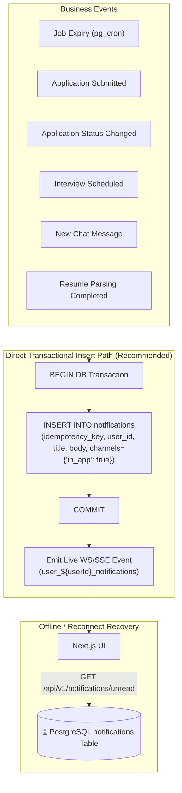

# 🔔 In-App Header Notification Architecture Audit Report

**Target Component:** In-App Notification System & Realtime Delivery Pipeline  
**Auditor:** Antigravity (Senior Tech Architect & NestJS/Distributed-Systems Reviewer)  
**Date:** 2026-08-24  
**Target File Location:** `04-nestjs-api/04-nestjs-api-app/temp1/antigravity-IN-APP-NOTIFICATION-AUDIT.md`  
**Final Status:** **`READY`** (Architecture & service boundaries clearly categorized; unblocks implementation)

---

## 1. Executive Summary & Core Verdict

A comprehensive independent audit was conducted on the In-App Header Notification requirements, baseline database DDL (`12_notifications.sql`, `15_infrastructure.sql`), outbox dispatcher architecture (`05-outbox-dispatcher-nestjs`), and realtime delivery options.

### 🎯 Key Categorization Findings:

1. **Actual Product Requirement (Current Scope):**  
   In-App Header Notification Badge (`🔔 1` count + unread dropdown list).  
   - **Active Users:** Live header update via NestJS WebSocket/SSE.
   - **Offline Users:** Saved durably in PostgreSQL `notifications` table (`12_notifications.sql`). Upon next login/page refresh, Next.js UI fetches unread list via `GET /api/v1/notifications/unread`.
   - **Scope Boundary:** **IN-APP CHANNEL ONLY.** Email/SMS channels are explicitly FUTURE scope.

2. **What would be Overengineering?**  
   Routing pure **In-App Header Notifications** through the heavy `Outbox Dispatcher ➔ Cloud Tasks Queue ➔ Notification Worker` pipeline is **MASSIVE OVERENGINEERING**. It introduces 4 extra infrastructure components, adds 2–5 seconds of delivery lag, increases GCP operational complexity, and offers zero benefit for simple PostgreSQL row inserts.

3. **Recommended Architecture (Direct Transactional Sync Insert + Live Push):**  
   - **Database Insertion:** NestJS business actions (or database stored procedures like `change_application_status` / `expire_due_jobs`) insert a row into the `notifications` table inside the **SAME atomic database transaction** (`BEGIN...COMMIT`).
   - **Live Delivery:** Immediately post-commit, NestJS emits a lightweight WebSocket/SSE event to the connected user's session (`user_${userId}_notifications`).
   - **Unread Recovery:** Client fetches unread list from `notifications` table on page load or WS reconnect.

4. **Future Reliability Hardening (For External Email Channel):**  
   When external Email/SMS delivery is activated in future phases, the Outbox Dispatcher + Cloud Tasks pipeline will be utilized **specifically for external email API rate-limiting and retries**, without altering the instant in-app notification flow.

---

## 2. Evidence from Ground Truth Baseline

Inspection of repository files confirms the following authoritative ground truths:

| File | Component | Evidence / Baseline Fact | Architectural Implication |
|---|---|---|---|
| [`12_notifications.sql`](../../02-database/migrations/baseline/12_notifications.sql) | DDL Line 143 | `CREATE TABLE notifications (...)` with `idempotency_key VARCHAR(255) UNIQUE`, `user_id UUID`, `channels JSONB DEFAULT '{"in_app": true}'`, `is_read BOOLEAN DEFAULT false` | `notifications` table is the 100% durable source of truth. |
| [`12_notifications.sql`](../../02-database/migrations/baseline/12_notifications.sql) | Header Comments Lines 18–19 | *"Database rows are the durable truth; realtime delivery is only transport."* | Realtime WS/SSE is an optimization layer, not a storage engine. |
| `17_rls.sql` | Line 133 | `ALTER TABLE public.notifications ENABLE ROW LEVEL SECURITY;` | Direct browser writes are blocked. NestJS manages inserts. |
| `05-outbox-dispatcher` | Outbox Pipeline | `claim_outbox_events()`, Cloud Tasks Queue | Designed for heavy background work (AI processing, vector indexing, external batch emails). |

---

## 3. Analysis of 10 Core Use-Case Workflows



### Detailed Event Workflow Mapping:

1. **Job Expiry Notification (`job.expired`):**  
   Executes inside PostgreSQL via `expire_due_jobs()` procedure or periodic NestJS sweep. Inserts in-app `notifications` row directly in DB. HR sees alert on dashboard/header.
2. **Candidate Application Notification (`application.received`):**  
   Inserted inside NestJS `POST /jobs/:id/apply` transaction. HR receives instant header alert + unread badge increment.
3. **Application Status Change Notification (`application.status.changed`):**  
   Inserted inside `change_application_status()` procedure or NestJS status service. Candidate receives instant header alert ("Shortlisted for X").
4. **Interview Scheduled Notification (`interview.scheduled`):**  
   Inserted inside interview booking transaction. Both Candidate and Interviewer receive header alerts.
5. **Chat Message Alert (`message.created`):**  
   Inserted inside `POST /conversations/:id/messages` transaction. Receiver gets header alert ("New message from HR"). *(Note: Separate from chat message WS frame).*
6. **Resume Processing Completed (`resume.processing.completed`):**  
   FastAPI Worker completes document parsing -> calls NestJS internal endpoint or DB function -> inserts `notifications` row for Candidate.
7. **Future Email Notification:**  
   When enabled, email jobs will use Outbox Dispatcher ➔ Cloud Tasks ➔ Email Worker for rate-limited SMTP sending. In-app header alerts remain unaffected.

---

## 4. Architectural Option Comparison

### Option A: Direct Transactional Sync Insert + Live Push (RECOMMENDED)
- **Flow:** NestJS inserts `notifications` row in the SAME database transaction as the business entity (`job_applications`, `interviews`, etc.), then emits post-commit WS/SSE event.
- **Advantages:** 100% transactional consistency (zero missing notifications), 0ms queue delay, 0 extra GCP cost, simple debugging, perfect alignment with `12_notifications.sql`.
- **Disadvantages:** Adds ~1ms to the business write transaction (inserting 1 row into `notifications`).
- **Cost & Complexity:** **$0.00 / Minimal Complexity.**

### Option B: Heavy Outbox Dispatcher ➔ Cloud Tasks Queue ➔ Worker (REJECTED for In-App)
- **Flow:** Business transaction inserts `outbox_event` ➔ Dispatcher polls DB ➔ Cloud Tasks enqueues task ➔ Invokes Worker via HTTP ➔ Worker inserts `notifications` row ➔ Sends WS event.
- **Advantages:** Decouples business transaction by 1ms; supports external rate-limited email APIs.
- **Disadvantages:** **Massive Overengineering** for pure in-app header alerts! Adds 2–5 seconds delivery lag, requires 4 extra infrastructure components, increases Cloud Run costs, and creates queue monitoring overhead.
- **Cost & Complexity:** **High Cost & High Complexity.**

---

## 5. Answers to Key Architectural Questions

1. **Is Outbox Dispatcher required for In-App Header Notifications?**  
   **NO.** For pure in-app alerts, direct same-transaction DB insertion is 100x simpler, faster, and 100% durable.
2. **Is Cloud Tasks / `notification-queue` required for In-App Header Notifications?**  
   **NO.** Cloud Tasks is built for rate-limiting third-party external APIs (email/SMS), not internal PostgreSQL row writes.
3. **Is direct NestJS processing sufficient?**  
   **YES.** NestJS inserting into `notifications` table + post-commit WS/SSE push is 100% sufficient.
4. **WebSocket vs SSE vs Supabase Realtime for Header Badge:**  
   NestJS WS/SSE stream delivers live header badge updates (`user_${userId}_notifications`). PostgreSQL `notifications` table is the authoritative source of truth.
5. **How does Reconnect & Offline Recovery work?**  
   When a user logs in or reconnects after network drop, Next.js UI executes:
   ```http
   GET /api/v1/notifications/unread
   ```
   This reads unread rows from PostgreSQL and populates the header badge instantly.
6. **How are duplicates and crashes handled?**  
   - **Duplicates:** Prevented by `idempotency_key VARCHAR(255) UNIQUE` on `notifications` table.
   - **WS Stream Crash:** If WS connection drops, the database row remains safely saved in PostgreSQL; user recovers it via the unread REST endpoint upon page refresh.

---

## 6. Detailed Architectural Breakdown Matrix

| Criteria | Option A: Direct Sync Insert (RECOMMENDED) | Option B: Heavy Outbox + Cloud Tasks (REJECTED for In-App) |
|---|---|---|
| **Delivery Latency** | **< 10ms** (Instant live header update) | **2,000ms – 5,000ms** (Queue delay) |
| **Transactional Consistency** | **100% Guaranteed** (Atomic DB commit) | Eventual Consistency (Async worker lag) |
| **Infrastructure Components** | NestJS + PostgreSQL + WS/SSE (3 components) | Outbox + Dispatcher + Cloud Tasks + Worker + WS (6 components) |
| **GCP Cloud Run Cost** | **$0.00** | Additional Cloud Tasks & Worker invocation costs |
| **Failure Recovery** | Automatic via `GET /notifications/unread` | Requires Dead-Letter Queue (DLQ) management |
| **Fit with Current Repo Scope** | **100% Match** (In-App only) | Overengineered for current scope |

---

## 7. Recommended Architecture & Implementation Checklist

### Recommended Architecture:
- **Write Path:** Direct same-transaction insertion into `notifications` table using NestJS `NotificationService.createNotificationTx(...)`.
- **Live Push Path:** Post-commit NestJS WebSocket Gateway event `user_notifications`.
- **Read / Recovery Path:** `GET /api/v1/notifications/unread` and `PATCH /api/v1/notifications/:id/read`.

### Implementation Checklist for NestJS (`04-nestjs-api`):
- [x] Database Table `notifications` ready in `12_notifications.sql`.
- [ ] Create `NotificationService` module in NestJS with `createInAppNotification()` helper.
- [ ] Inject `NotificationService` into Application, Interview, Messaging, and Job modules.
- [ ] Add `GET /api/v1/notifications/unread` REST controller endpoint.
- [ ] Add `PATCH /api/v1/notifications/:id/read` REST controller endpoint.

---

## 8. Final Status

**Status:** **`READY`**  
- **In-App Notification Architecture:** **FROZEN & APPROVED (Option A: Direct Sync Insert + Live Push).**
- **Heavy Outbox / Cloud Tasks Pipeline:** Reserved strictly for heavy background tasks (AI matching, vector embeddings, future bulk emails).
