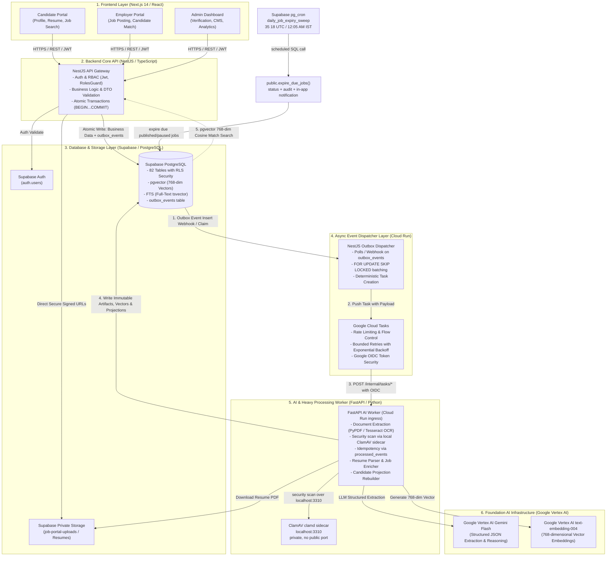

# System Architecture Diagram & Complete Technical Blueprint

[← Main README](../../README.md) · [Project Context Map](../../PROJECT-CONTEXT-MAP.md) · [Migration Plan](../../MIGRATION-PLAN-HINGLISH.md)

---

## 🗺️ End-to-End System Architecture

---

## 🧩 Architectural Layers & Responsibilities

### 1. Frontend Layer (`03-nextjs-web`)
* **Framework:** Next.js 14 (App Router) + React + Tailwind CSS + TypeScript.
* **Target Users:** Candidates (Job Seekers), Employers (Recruiters / Hiring Managers), System Admins.
* **Key Features:** Drag & Drop Resume Upload, Real-Time Fitment Score Badges, Kanban Application Pipeline, AI Matched Job Recommendations.

### 2. Backend Core API Gateway (`04-nestjs-api`)
* **Framework:** NestJS + Fastify / Express + TypeScript.
* **Security & Auth:** JWT Guards, RBAC (`candidate`, `employer`, `hr`, `admin`), Supabase Auth token verification.
* **Transactional Outbox:** Har write transaction mein business rows ke saath `outbox_events` table mein state-change event synchronously commit karta hai (Zero Data Loss guarantee).

### 3. Database & Object Storage Layer (`02-database`)
* **Database:** Supabase Managed PostgreSQL.
* **Scale & Schema:** 82 Normalized relational tables, 82/82 Row Level Security (RLS) policies enabled.
* **AI & Search Extensions:** `pgvector` (for 768-dimensional Vector Cosine Similarity), `pg_trgm` (fuzzy matching), `to_tsvector` (PostgreSQL Full-Text Search).
* **Storage:** Supabase Storage Private Bucket (`job-portal-uploads`) for resumes, certificates, and company verification documents.
* **Job expiry:** Supabase `pg_cron` runs `daily_job_expiry_sweep` at `35 18 * * *` UTC
  (12:05 AM Asia/Kolkata) and calls `public.expire_due_jobs()`. The function atomically updates
  due published/paused jobs, writes `audit_logs`, and creates the approved creator-only in-app
  notification. This deterministic path does not use the Dispatcher or Cloud Tasks.

### 4. Async Event Dispatcher Layer (`05-outbox-dispatcher` & `06-google-cloud-tasks`)
* **Dispatcher:** Lightweight NestJS microservice running on Google Cloud Run.
* **Batch Claiming:** Uses `SELECT ... FOR UPDATE SKIP LOCKED` to prevent duplicate task scheduling across multiple dispatcher instances.
* **Queue:** Google Cloud Tasks provides rate-limiting, exponential backoff retries, dead-lettering, and Google OIDC authentication tokens.

### 5. AI Worker Layer (`07-fastapi-ai-worker`)
* **Framework:** FastAPI (Python 3.12) + SQLAlchemy 2.0 Async + Pydantic v2.
* **Idempotency:** Strictly verifies incoming task IDs against `processed_events` table.
* **Capabilities:**
  - PDF / DOCX native parsing and OCR fallback (Tesseract).
  - Resume structured fact extraction (PD-001).
  - Symmetric Semantic Text compilation for 8-table candidate aggregates (PD-002).
  - Job Description AI Enrichment (JD-001).

### 6. Foundation AI Models (Google Cloud Vertex AI)
* **LLM Extraction & Reasoning:** Google Vertex AI `gemini-2.5-flash` / `gemini-2.0-flash` (Structured Output Schema enforcement).
* **Vector Embeddings:** Google Vertex AI `text-embedding-004` (768-dimensional dense numerical coordinates).
